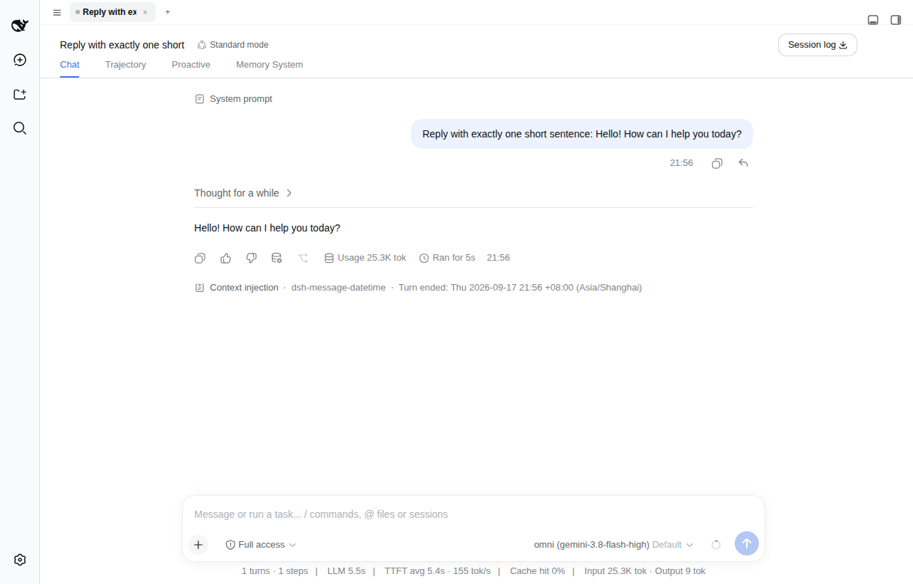

# dsh-message-datetime

<p align="center">
  <a href="./README.md"><strong>简体中文</strong></a> ·
  <a href="./README.en.md"><strong>English</strong></a>
</p>

每个对话 turn 开始与结束时，向模型上下文注入**简短时间戳**的 dsh 插件（DeepSeek Harness / cordis plugin）。

模型由此始终知道"现在几点、今天星期几、上一轮何时结束"——日期运算、"今天/明天"语义、跨轮空闲间隔感知、yymmdd 路径命名等不再需要询问用户或猜测。

## 模型看到什么

每个 turn 的第一个 step，在用户消息之后追加一条单行通知（约 30 token，append-only 不破坏 KV cache）：

```
Current time: Tue 2026-09-15 01:04:34 +08:00 (Asia/Shanghai)
```

turn 正常收尾时（`agent/turn-stopping` 边界，最后一条 step/end 之后、turn/end 之前），再追加一条单行关闭读数：

```
Turn ended: Tue 2026-09-15 01:41:20 +08:00 (Asia/Shanghai)
```

下一轮模型由此直接读到上一轮的结束时间。两条通知在 GUI 中均渲染为折叠的 context chip（非用户气泡），折叠行显示去掉秒的摘要，点击展开完整文本。



## 行为规则

- **每 turn 恰两条**：仅 `step === 1` 注入开场读数；turn 内后续 step（工具调用续步）不重复。turn 正常结束时注入关闭读数。
- **中断轮无关闭读数**：abort / error / 空输入等路径不会派发 `agent/turn-stopping`，被打断的轮次只有 `turn/end` 事件记录原因，无通知。
- **关闭读数绝不打断收尾**：turn-stopping 是 serial 派发，监听器任何失败只 warn 降级，绝不抛出（抛错会把本轮 `turn/end` reason 污染为 error）。
- **时区一致**：关闭读数复用本 turn 开场读数选定的时区（无开场读数则回退配置时区），两条读数时区永远一致。
- **覆盖所有会话**：用户 turn、goal 自动续跑 round、subagent turn 均注入（subagent 无浏览器上下文，最需要时钟）。
- **时区解析链**：本 turn 浏览器上报时区（`clientTimeZone`，唯一时才采用）→ 配置的 `timeZone` 回退 → Node 进程时区。无效值静默回退，绝不打断 turn。
- **replay 安全**：两条读数均为 `user/message`（plugin-attributed notice）——开场读数在 step 窗口内，关闭读数在 `turn/end` 之前的轮间位置（dsh-session invariant 对 `user/message` 无位置约束），满足 token-meter replay 约束；机制与官方 `@deepseek-ai/dsh-time-context` 同源。

## 配置

```yaml
- id: message-datetime
  name: dsh-message-datetime
  config:
    timeZone: Asia/Shanghai   # 可选：浏览器时区不可用时的回退显示时区（默认进程时区）
```

## 与官方 dsh-time-context 的区别

| 维度 | @deepseek-ai/dsh-time-context | dsh-message-datetime |
|------|-------------------------------|----------------------|
| 注入频率 | 每个 eligible step | 每 turn 两条（开场 + 收尾） |
| 单条体量 | 三行（时间 + 时区政策 + elapsed） | 单行 |
| 定位 | 严格时区政策解释（Schedule 场景，opt-in） | 轻量时钟感知 + 跨轮间隔感知（常驻） |

两者不建议同时启用（会双重时间注入）。

## 安装

```bash
dsh plugin --profile web add dsh-message-datetime
```

安装后无需手动改配置，插件自带的 `cordis.patch.yml` 自动挂载生效；`timeZone` 为可选回退项（见上文配置）。

从 GitHub 直装（源码安装，pnpm ≥10 需允许构建脚本）：

```bash
dsh plugin --profile web add github:john-walks-slow/dsh-message-datetime
# 首次 add 会被 pnpm 拦截：把 pnpm 提示的包名加入
# ~/.dsh/profiles/web/pnpm-workspace.yaml 的 allowBuilds 后重跑
```

## 权限与兼容

- **零权限**：无外部服务、无网络请求、无文件系统写入；仅向会话上下文追加两条 `user/message` 通知
- **依赖**：`@deepseek-ai/cordis` 4.0.2 / `@deepseek-ai/dsh-llm` 0.1.2-rc.1（与 dsh 0.1.2-rc.1 锁定版本对齐），Node ≥ 22.5
- **中断安全**：任何注入失败均降级为 warn，绝不打断 turn

## 本地开发

```bash
npm install
npm run build     # tsc → dist/src
npm test          # tsc(含 test) + node --test dist/test/*.test.js
```

本机 profile 接线（link 方式）：`/root/.dsh/profiles/web/package.json` 的 `dsh.profile.bundles` 数组加 `"dsh-message-datetime"`，`dependencies` 加 `"dsh-message-datetime": "link:/root/projects/dsh-message-datetime"`，然后 `pnpm install`。

- 参考实现：`@deepseek-ai/dsh-time-context`（/usr/lib/node_modules/@deepseek-ai/dsh/node_modules/@deepseek-ai/dsh-time-context）
- 依赖必须显式声明在 `dependencies` 并本地安装（link 包 ESM 解析坑，见 dev-dsh-plugin 技能）

## 发新版

改动入库后一条命令完成测试、版本号、打包（`npm version` 会自动 commit 并打 tag）：

```bash
npm run release        # patch；较大更新改用：npm version minor 或 major
```

然后指纹发布并推送：

```bash
node ~/.agents/skills/npm-publish/scripts/publish-webauthn.cjs /tmp/dsh-message-datetime-<新版>.tgz
git push --follow-tags
```

发布后 `npm view dsh-message-datetime version` 复验。批量发多个包时，在指纹页勾选“5 分钟内同 IP 不再挑战”，一次指纹即可连发。
